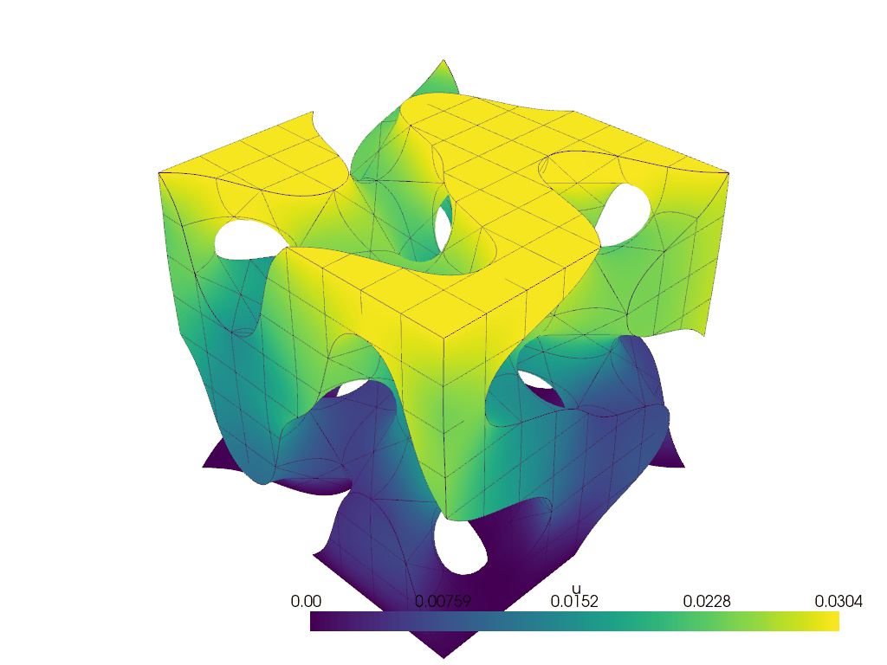

# QUGaR: Quadratures for Unfitted GeometRies
QUGaR is a C++ library designed to generate efficient quadrature rules for computing integrals in high-order unfitted/immersed/CutFEM methods. Additionally, it offers functionalities for generating unfitted domain reparameterizations for visualization purposes.

Currently, QUGaR is in its early stages. Initially, it supports unfitted domains created by implicit functions via [Algoim](https://algoim.github.io). Future updates will include support for 2D and 3D [B-reps](https://en.wikipedia.org/wiki/Boundary_representation).

While it is intended to be used with any library, QUGaR provides out-of-the-box interoperability with the [FEniCSx](https://fenicsproject.org) Python interfaces. See the provided [demos](https://pantolin.github.io/qugar/main/demos.html).

Here is a demo of QUGaR being used to reparametrize an unfitted hyperelastic body undergoing large deformations.



<!-- 
 -->


# Documentation

Documentation can be viewed at https://pantolin.github.io/qugar/main/index.html.

# Installation

> [!NOTE]  
> Right now, QUGaR installation has to be done "manually" from the sources. However, it is our intention to provide a [conda-forge](https://conda-forge.org) recipe in the near future. Stay tuned!

## Easiest installation method: Conda script

The easiest way to install QUGaR is to use the provided conda installation script. This script automatically sets up a conda environment with all required dependencies and builds both the C++ library and Python interface.

**Prerequisite:** [Conda](https://docs.conda.io/en/latest/) (Miniconda or Anaconda) must be installed on your system.

First clone the repository and go inside:
```bash
git clone https://github.com/pantolin/qugar.git
cd qugar
```

Then run the installation script:
```bash
bash setup_with_conda.sh
```

### Script options

The script can be customized using environment variables:

- `QUGAR_ENV_NAME` - Name of the conda environment to create/use (default: `qugar-env`)
- `PYTHON_VERSION` - Python version to install (default: `3.10`)
- `INSTALL_LAPACKE` - Install LAPACKE support (default: `true`)
- `INSTALL_DOLFINX` - Install DOLFINx for FEniCSx interoperability (default: `true`)
- `USE_CONDA_COMPILERS` - Use conda compilers instead of system compilers (default: `false`, Linux/Windows only; macOS always uses system compilers)
- `SKIP_ENV_SETUP` - Skip conda environment setup and use existing environment (default: `false`)

Example with custom options:
```bash
QUGAR_ENV_NAME=my-qugar-env PYTHON_VERSION=3.11 INSTALL_DOLFINX=false bash setup_with_conda.sh
```

## Manual installation

If you prefer to install manually, follow the instructions below.

First clone the repository and go inside:
```bash
git clone https://github.com/pantolin/qugar.git
cd qugar
```

## C++ installation
To build and install the C++ library, from the `qugar/` root directory run:
```bash
cmake -G Ninja -DCMAKE_BUILD_TYPE=Release -B build -S cpp/
cmake --build build --parallel 4
cmake --install build
```

## Python interface installation

QUGaR's Python interface requires the C++ library. So before installing the Python interface, make sure you have the C++ library installed.

To build and install the Python interface, under the `qugar/` root directory run
```bash
python3 -m pip -v install -r ./python/build-requirements.txt
python3 -m pip -v install --no-build-isolation ./python -U
```
If you want to use QUGaR's functionalities together with FEniCSx library, [install also DOLFINx (v0.9.0)](https://github.com/FEniCS/dolfinx#installation), including [pyvista](https://pyvista.org) dependency.    


Further details about the installation of the C++ and Python modules can be found at https://pantolin.github.io/qugar/main/installation.html.

## Docker
It is also possible to use QUGaR from a docker container.
The docker file may be built and run from the `qugar/` root directory as
```bash
docker build -f docker/Dockerfile -t qugar .
docker run -it -v $(pwd):/root/shared -w /root/shared qugar bash -i
```

# License
QUGaR is free software: you can redistribute it and/or modify it under the terms of the [MIT license](https://opensource.org/license/mit).


