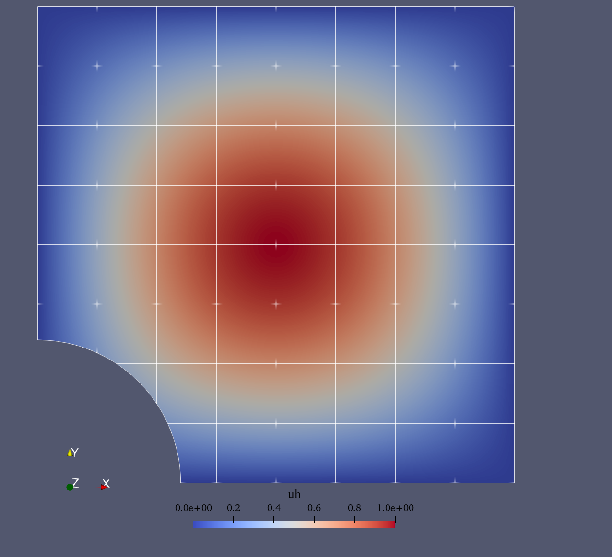
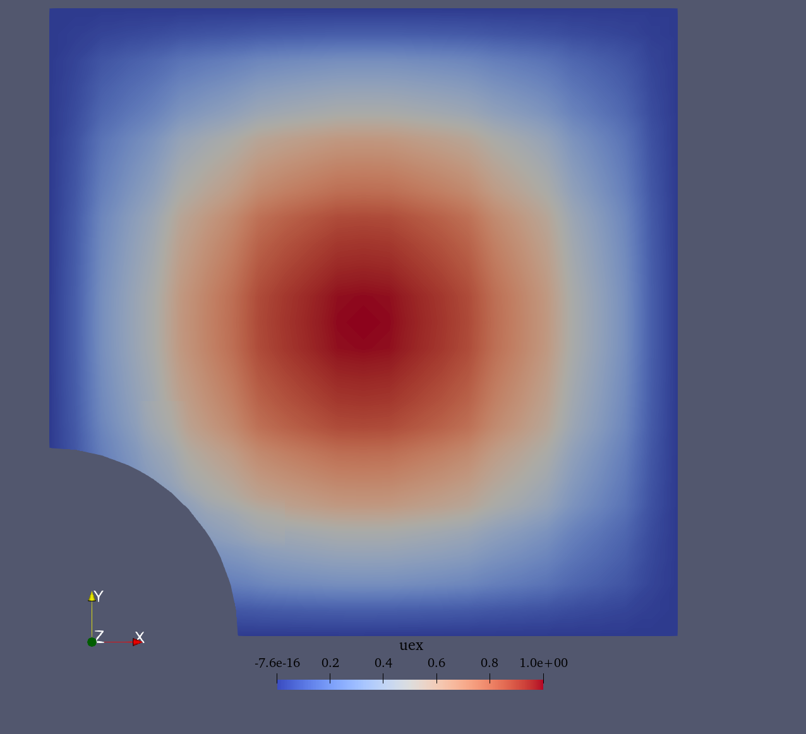

---
jupytext:
  text_representation:
    extension: .md
    format_name: myst
    format_version: 0.13
    jupytext_version: 1.17.1
  main_language: python
---

# Poisson problem

This demo is implemented in {download}`demo_poisson.py`. It
illustrates:

- How to solve a simple PDE using QUGaR and FEniCSx.
- How to impose Dirichlet conditions in a strong way.
- How to impose Neumann condition on an unfitted boundary.

## Problem definition

Let us consider the domain $\Omega \subset \mathbb{R}^n$,
immersed in a mesh $\mathcal{T}(\Omega)$ (see
[Divergence theorem demo](demo_div_thm.md) first for further details
about the immersed setting), and the finite element space $V$ defined
over the mesh $\mathcal{T}(\Omega)$. The Poisson problem reads:
Finding $u \in V$ such that

$$
\begin{align}
  - \nabla^{2} u &= f \quad {\rm in} \ \Omega, \\
  u &= 0 \quad {\rm on} \ \Gamma_{D}, \\
  \nabla u \cdot n &= g \quad {\rm on} \ \Gamma_{N}.
\end{align}
$$

where $f$ and $g$ are input data and $n$ denotes the outward directed
boundary normal. The variational problem reads: find $u \in V_D$ such
that

$$
a(u, v) = L(v) \quad \forall \ v \in V_0,
$$

where $V_D$ is the space of functions that satisfy the Dirichlet
boundary conditions, $V_0$ is the space of test functions that
vanish on the Dirichlet boundary $\Gamma_D$, and $a(u, v)$ and
$L(v)$ are the bilinear and linear forms defined as:

$$
\begin{align}
  a(u, v) &:= \int_{\Omega} \nabla u \cdot \nabla v \, {\rm d} x, \\
  L(v)    &:= \int_{\Omega} f v \, {\rm d} x + \int_{\Gamma_{N}} g v \, {\rm d} s.
\end{align}
$$

In this demo we consider a domain $\Omega$ that is the *classical*
plate with hole defined as a square domain $[0,1]^2$ and the hole has
radius $R=0.3$ and it is centered at $(0,0)$ (see the figure below).
We consider that the Neumann boundary $\Gamma_N$ correponds to the
circular section of the boundary, while the Dirichlet boundary is its
complement $\Gamma_D=\partial\Omega\setminus\Gamma_N$.

```{figure} assets/poisson_demo_geom.png
:name: fig-demo-poisson-geom
Plate with hole unfitted domain.
```

For the Poisson problem we consider the following a manufactured
solution (see figure below):

$$
\begin{align}
  u(x,y) &= \sin(\pi x) \sin(\pi y), \\
  f(x,y) &= -\Delta u, \\
  g(x,y) &= \nabla u \cdot n.
\end{align}
$$

```{figure} assets/poisson_demo_uex.png
:name: fig-poisson-demo-manufactured
Manufactured solution.
```

## Implementation

### Modules import
First we add the needed modules and functions:

```python

from qugar.utils import has_FEniCSx, has_PETSc

if not has_FEniCSx:
    raise ValueError("FEniCSx installation not found is required.")

if not has_PETSc:
    raise ValueError("petsc4py installation not found is required.")


from pathlib import Path

from mpi4py import MPI

import dolfinx.fem
import dolfinx.fem.petsc
import dolfinx.io
import numpy as np
import ufl
from dolfinx import default_scalar_type as dtype

import qugar
import qugar.impl
from qugar.dolfinx import LinearProblem, ds_bdry_unf, mapped_normal
from qugar.mesh import create_unfitted_impl_Cartesian_mesh
```

### Geometry and mesh

+++

We define the plate with hole geometry as the the negative part
of a disk of radius $R=0.3$ centered at the origin.

```python
radius = 0.3
disk = qugar.impl.create_disk(radius, center=np.array([0, 0], dtype))
impl_func = qugar.impl.create_negative(disk)
```

We create an {py:class}`unfitted Cartesian mesh<qugar.mesh.UnfittedCartMesh>`
(corresponding to $\mathcal{T}$) in which we embed the domain $\Omega$.
This is a Cartesian mesh corresponding to the domain $[0,1]^2$ and
with `n_cells` cells per direction.

```python
n_cells = 8

unf_mesh = create_unfitted_impl_Cartesian_mesh(
    MPI.COMM_WORLD, impl_func, n_cells, exclude_empty_cells=True, dtype=dtype
)
```

### Spaces and functions

+++

We create the manufactured solution, its gradient, and source term:

```python
x = ufl.SpatialCoordinate(unf_mesh)
uex = ufl.sin(np.pi * x[0]) * ufl.sin(np.pi * x[1])
grad_uex = ufl.grad(uex)
f = -ufl.div(grad_uex)  # -np.pi * np.pi * uex
```

and the finite element space $V$ over the unfitted mesh
(corresponding to the mesh $\mathcal{T}$) needed to define the test
and trial functions $u$ and $v$.
The finite element space is defined as a Lagrange space of the given
`degree` (2 in this case).

```python
degree = 2
V = dolfinx.fem.functionspace(unf_mesh, ("Lagrange", degree))
u, v = ufl.TrialFunction(V), ufl.TestFunction(V)

facets = dolfinx.mesh.locate_entities_boundary(
    unf_mesh,
    dim=(unf_mesh.topology.dim - 1),
    marker=lambda x: np.isclose(x[0], 0.0)
    | np.isclose(x[0], 1.0)
    | np.isclose(x[1], 0.0)
    | np.isclose(x[1], 1.0),
)
```

We now find the degrees-of-freedom that are associated with the
boundary facets using {py:func}`locate_dofs_topological
<dolfinx.fem.locate_dofs_topological>`:

```python
dofs = dolfinx.fem.locate_dofs_topological(V=V, entity_dim=1, entities=facets)
```

and use {py:func}`dirichletbc <dolfinx.fem.dirichletbc>` to create a
{py:class}`DirichletBC <dolfinx.fem.DirichletBC>` class that
represents the boundary condition:

```python
bc = dolfinx.fem.dirichletbc(value=dtype(0), dofs=dofs, V=V)
```

Note that for this particular solution, the exact condition is
zero on $\Gamma_D$.

+++

### Linear forms

+++

We define the variational problem to be solved, which is
equivalent to the $L^2$ projection of $f$ onto $V$, and generate
the corresponding bilinear and linear forms `a` and `L` using
QUGaR's custom form functions.
The number of quadrature points per cell (or integration cell
in the case of cut cells) is set to `degree + 1` to
prevent DOLFINx from using a higher-order quadrature rule
(because of the trigonometric right-hand side expression).

```python
n_quad_pts = degree + 1
quad_degree = 2 * n_quad_pts + 1
ds_unf = ds_bdry_unf(domain=unf_mesh, degree=quad_degree)
g = ufl.dot(grad_uex, mapped_normal(unf_mesh))
a = ufl.dot(ufl.grad(u), ufl.grad(v)) * ufl.dx(degree=quad_degree)
L = f * v * ufl.dx(degree=quad_degree) + g * v * ds_unf
```

### Linear system solution

+++

We solve the associated linear system
$A\mathbf{u} = \mathbf{b}$, where $\mathbf{u}$ is the
solution of the problem. The solution is stored in a
a finite element function `uh` defined over the same finite
element space $V$ as the trial functions.

In this case we use a direct solver (Cholesky) to solve the
linear system. However, due to the potentially ill-conditioning
of the matrix, we use a (symmetric) Jacobi preconditioner.
It is known that Jacobi preconditioners are not very effective
for Lagrange elements, but still help.

```python
petsc_options = {
    "ksp_type": "preonly",
    "pc_type": "cholesky",
    "ksp_diagonal_scale": True,  # Jacobi
    # "ksp_diagonal_scale_fix": True, # transformsa back A an b after Jacobi
}


problem = LinearProblem(a, L, bcs=[bc], petsc_options=petsc_options)
problem.solve()

uh = problem.u
```

### Visualization

+++

Finally, we visualize the obtained solution by generating reparameterization
meshes and interpolating the solution into them.
For further details check the
[Visualization section](demo_L2_projection.md#visualization) in the $L^2$ projection demo.
an auxiliar mesh that reparameterizes the unfitted domain.

```python
rep_degree = 3
reparam = qugar.reparam.create_reparam_mesh(unf_mesh, degree=rep_degree, levelset=False)
rep_mesh = reparam.create_mesh()
rep_mesh_wb = reparam.create_mesh(wirebasket=True)

Vrep = dolfinx.fem.functionspace(rep_mesh, ("CG", rep_degree))
interp_data = qugar.reparam.create_interpolation_data(Vrep, V)
uh_rep = dolfinx.fem.Function(Vrep, dtype=dtype)
uh_rep.interpolate_nonmatching(uh, *interp_data)
uh_rep.name = "uh"

Vrep_wb = dolfinx.fem.functionspace(rep_mesh_wb, ("CG", rep_degree))
interp_data_wb = qugar.reparam.create_interpolation_data(Vrep_wb, V)
uh_rep_wb = dolfinx.fem.Function(Vrep_wb, dtype=dtype)
uh_rep_wb.interpolate_nonmatching(uh, *interp_data_wb)
uh_rep_wb.name = "uh"
```

Together with the approximate solution `uh_rep`, we also
interpolate the exact solution `uex_rep` into the reparameterization
mesh.

```python
uex_rep = dolfinx.fem.Function(Vrep, dtype=dtype)
uex_expression = dolfinx.fem.Expression(uex, Vrep.element.interpolation_points())
uex_rep.interpolate(uex_expression)
uex_rep.name = "uex"
```

Finally, we export the meshes to VTK files and visualize them
using ParaView (see the figures below).

```python
results_folder = Path("results")
results_folder.mkdir(exist_ok=True, parents=True)
filename = results_folder / "poisson_projection"

with dolfinx.io.VTKFile(rep_mesh.comm, filename.with_suffix(".pvd"), "w") as vtk:
    vtk.write_function(uh_rep)
    vtk.write_function(uh_rep_wb)
    vtk.write_function(uex_rep)
```

| Approximate solution | Exact (manufactured) solution |
|:---:|:---:|
|  |  |
